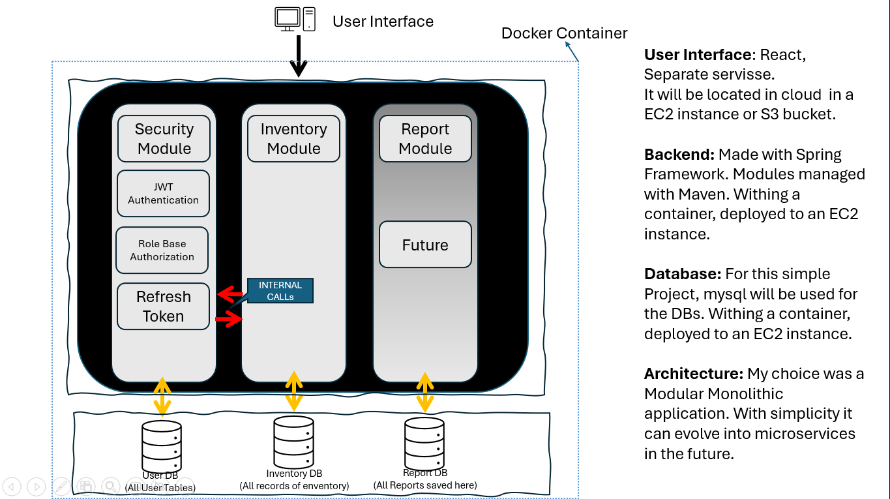

# Welcome to Click Manage! 👋🏻

Build JWT Refresh Token with Spring Security in the Spring Boot Application. You can know how to expire the JWT Token, then renew the Access Token with Refresh Token in HttpOnly Cookie.

## 🧾 Click-Manage – Software Requirements

## 📌 Project Scope
Click-Manage is a multi-tenant inventory and stock management system designed to serve multiple businesses while ensuring strict data isolation. It supports stock tracking, auditability, role-based access, and procurement management.

## To use the deployed version of the project:
1. **Backend - enpoints found at:**: http://captain.raulsouto.com:8080
   - username: rmss
   - password: rmss1234
- OBS: No need to set up tokens. Tokens are managed via cookies when using postman.
3. **Documentation**: [Click-Manage Documentation](http://captain.raulsouto.com:8080/swagger-ui/index.html#/)
 
## Last section shows workflow to be followed once using this application.
## Documentation
Once running project, by accessing [Server-Address]/swagger-ui/index.html#/, you can find the API documentation.


---

## 🚀 Core Features
1. **Multi-Business Support**
    - Each business has isolated data and users.
    - Super Admin can manage users across businesses.

2. **Role-Based Access Control**
    - Roles: Super Admin, Admin, Moderator, User
    - Each role has granular permission over specific operations.

3. **Inventory Management**
    - CRUD operations for `Item`, `ItemType`, and `Stock`
    - Unique constraints on item names and barcodes per business

4. **Stock Movement**
    - **ItemEntry**: Records stock additions (with Supplier, optional expiry/lot)
    - **ItemExit**: Records stock removal (with optional reason/lot)

5. **Stock Tracking**
    - `Stock` is a separate entity linked one-to-one with each item
    - Automatic adjustment on entries and exits

6. **Suppliers**
    - CRUD operations with unique name/tax ID per business
    - Linked to item entries for procurement tracking

7. **User Management**
    - Filter/search by username, email, role, and business
    - Admins see only their business; Super Admin can access all

8. **Filtering & Pagination**
    - All listing endpoints support filtering and pagination
    - Sorting direction and fields are customizable (default: ASC by name)

9. **Validation & Error Handling**
    - Custom exceptions (e.g., `ItemAlreadyExistsException`, `InsufficientStockException`)
    - Global exception handler with structured API error responses

---

## 👥 User Stories
- As an **Admin**, I want to manage items, item types, and suppliers for my business.
- As a **Moderator**, I want to record new stock entries and exits with all required traceability.
- As a **Super Admin**, I want to view and manage all users across all businesses.
- As a **System**, I want to validate inputs and return meaningful error messages.
- **User** Future usage - Invited to view or perform action in system.


## ‍🎨 🖌️ Domain modeling 

### Class Diagrams:
1. **Security Module: **

2. **Inventory Module: **


## Tech Stack Explanation
- **Java 17**: The project uses Java 17 as the base language due to its long-term support (LTS) and improved performance and language features over earlier versions. It provides stability and maturity suitable for enterprise applications. The plan is to upgrade to Java 23 in the future to take advantage of newer enhancements.
- **Spring Boot**: Spring Boot simplifies backend development by offering robust dependency management, built-in configuration, and an opinionated project structure. It accelerates RESTful API development and seamlessly integrates with Spring Data JPA, Spring Security, and validation frameworks.
- **MySQL**: MySQL is a reliable and widely adopted relational database system. It offers strong ACID compliance, ease of use, and compatibility with JPA/Hibernate, making it a natural choice for storing structured data like items, users, and stock entries.
- **Swagger (SpringDoc OpenAPI)**: Swagger is used for automatic API documentation generation, allowing developers and stakeholders to explore and test endpoints via an interactive web interface. It improves usability and helps in API lifecycle management.
- **Docker**: Docker provides containerization to ensure consistency across development, staging, and production environments. It simplifies deployment by encapsulating the application and its dependencies, making it easy to run on various infrastructures, including cloud platforms.
- **AWS EC2**: AWS EC2 is used for hosting the application, providing scalable and reliable infrastructure. It allows for easy scaling, load balancing, and integration with other AWS services, ensuring high availability and performance.

## Architecture Design
 For now, instead of each module having its own database, we are using a single database with multiple schemas. This allows for easier management and deployment, especially in the initial stages of development. However, as the application scales and the number of businesses increases, we will consider moving to a multi-database architecture for better isolation and performance.



## ER Diagram


## DTO Usage & Validation

[Inventory DTO](src/main/java/com/bezkoder/spring/inventory/dto)

[Security DTOs](src/main/java/com/bezkoder/spring/security/jwt/payload)

## Data Persistence
Inventory Module:
- [Entities](src/main/java/com/bezkoder/spring/inventory/model)
- [Repository](src/main/java/com/bezkoder/spring/inventory/repository)

Security Module:
- [Entities](src/main/java/com/bezkoder/spring/security/jwt/models)
- [Repositories](src/main/java/com/bezkoder/spring/security/jwt/repository)

## RESTFUL API DESIGN

Inventory Module:
- [Controller](src/main/java/com/bezkoder/spring/inventory/controller)

Security Module:
- [Controllers](src/main/java/com/bezkoder/spring/security/jwt/controllers)

## Global Exception Handling

Inventory Module:
- [Exception Handling](src/main/java/com/bezkoder/spring/inventory/exception)

Secutity Module:
- [Exception Handling](src/main/java/com/bezkoder/spring/security/jwt/exception)

## Pagination Implementation
- Found in the Repositories and Services.

## Software Testing
[TESTS](src/test)
## Configure Spring Datasource, JPA, App properties
Open `src/main/resources/application.properties`


## Configure Spring Datasource, JPA, App properties
```properties
spring.datasource.url= jdbc:mysql://localhost:3306/testdb?useSSL=false
spring.datasource.username= root
spring.datasource.password= 123456

spring.jpa.properties.hibernate.dialect= org.hibernate.dialect.MySQLDialect
spring.jpa.hibernate.ddl-auto= update

# App Properties
bezkoder.app.jwtSecret= bezKoderSecretKey
bezkoder.app.jwtExpirationMs= 3600000
bezkoder.app.jwtRefreshExpirationMs= 86400000
```

## Run Spring Boot application
```
mvn spring-boot:run
```

## Run following SQL insert statements
### To create the roles used in the system:
```sql
INSERT INTO roles(name) VALUES('ROLE_USER');
INSERT INTO roles(name) VALUES('ROLE_MODERATOR');
INSERT INTO roles(name) VALUES('ROLE_ADMIN');
INSERT INTO roles(name) VALUES('ROLE_SUPERADMIN');
```

### To create the first superuser of the system:
login: superadmin_user
password: rmss1234
```sql
-- Create address for the business
INSERT INTO address (id, city, country, postal_code, state, street)
VALUES (1, 'Fairfield', 'USA', '52557', 'IA', '1000 N 4th St');

-- Create Business
INSERT INTO businesses (id, industry, name, address_id)
VALUES (1, 'The Owner', 'All Knowing.', 1);

-- Insert the user into the users table
INSERT INTO users (email, password, username, business_id)
VALUES ('superadmin@example.com', '$2a$10$z4u.bUn8.GivdL/I9.lLy.wP.tSd1Y0oqA8jRj700dlOXuV7yTF7e', 'superadmin_user', 1);

-- Now insert the corresponding role into the user_roles table
-- First, get the ID of the newly inserted user. For example, assume it returns ID = 5:
-- You can get the ID using: SELECT LAST_INSERT_ID();

-- Insert role mapping into the user_roles table
INSERT INTO user_roles (user_id, role_id)
VALUES (LAST_INSERT_ID(), 4);
```

## Mainflow of the application
- When running:
   - {{ec2Address}}: http://captain.raulsouto.com:8080.
   - If running locally, use localhost:8080.
1. **Login**:
- Endpoint: POST `/api/auth/signin`
```json
{
  "username": "rmss",
  "password": "rmss1234"
}
```

2. **Create Item Type**:
- Endpoint: POST `/api/item-types`
```json
{
   "name": "Food",
   "description": "Eatable items."
}
```

3. **Create Item**:
-Endpoint: POST `/api/items`
```json
{
   "name": "Milkshake",
   "description": "Drink made with Icecream",
   "barCode": "ASDQWEASD",
   "type": {
      "name": "Food"
   }
}
```

4. **Create Supplier**:
- Endpoint: POST `/api/suppliers`
```json
{
   "name": "Supplier 1",
   "taxId": "123456789",
   "address": {
      "city": "Fairfield",
      "country": "USA",
      "postalCode": "52557",
      "state": "IA",
      "street": "1000 N 4th St"
   }
}
```

5. **Create Item Entry**:
- Endpoint: POST `/api/item-entries`
```json
{
   "itemId": 2,
   "supplierId": 2,
   "quantity": 50,
   "lotNumber": "LOT-202500Q7-Z"
   //  "expiryDate": "2025-12-31"
}
```

6. **Create Item Exit**:
- Endpoint: GET `/api/item-exits`
```json
{
   "itemId": 2,
   "quantity": 13,
   "lotNumber": "ABC123XQWE",
   "reason": "Sold items"
}
```

7. **Check all Item Stock**:
- Endpoint: `/api/stocks`
Request params:
```json
{
   "page": 0,
   "size": 10,
   "itemName": "Milkshake",
   "itemTypeName": "Food",
   "sortDirection": "id,asc"
}
```
